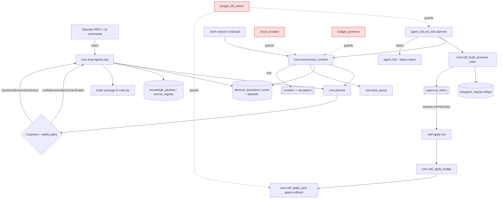

# Agent Anatomy / Cognitive Architecture Map

**Snapshot date: 2026-07-01.** This is a point-in-time map; connectivity drifts as
code changes. Re-run `scripts/agent_anatomy_check.py` to detect when the module
index below has fallen out of sync with `core/`.

This document is **read-only description**. It does not run, approve, apply, or
change any agent behavior. It maps the code that exists today; it is not a claim
that the agent is a finished autonomous organism.

## Maturity caveat (read this first)

The agent is **not** an integrated autonomous organism yet. It is a large set of
mostly-real subsystems, of which:

- a coherent subset is **wired-live** into three execution paths (interactive
  loop, autonomous runtime, daemon tick);
- a large number are **manual/operator-only** — reachable only through the `cli/`
  command package or a REPL/CLI action, never on the autonomous path;
- the role/subagent layer is **duplicated** across four independent mechanisms
  that do not share a registry, contract, or lifecycle;
- self-repair exists as a **human-gated proposal → approval → apply chain**, not
  as closed-loop self-modification.

A note on a correction made while writing this map: an earlier draft labeled
several modules "test-only orphans." That was wrong — it came from searching only
the top-level spine (`core/`, `main.py`, `agent_tick.py`) and missing the `cli/`
command package. After searching the whole tree, **no `core/` module is a true
orphan**: every one is imported by production code somewhere. The honest
distinction is *wired-live (on an autonomous path)* vs *manual-only (operator
must trigger it)* — not present vs absent.

Do not read this map as "the brain is done." Read it as "here is which organs
exist, which are innervated on an autonomous path, and which only move when the
operator pulls the lever."

## How to read this map

### Two architectures, kept separate

- **Target architecture** — the broad intended organism. Source of truth:
  `архитектура автономного Агента.txt` (logical/runtime/data/security/deployment/
  failure views) and `AGENT_DOCTRINE.md` (execution semantics). This document
  does **not** restate the target in full; it points to it and then describes
  what is actually wired.
- **Actual wired-live architecture** — what is reachable from a real execution
  path today. This is the bulk of this document.

### Status legend

| Status | Meaning |
|--------|---------|
| `wired-live` | Imported (directly or transitively) into a live autonomous execution path: interactive loop, autonomous runtime, or daemon tick. |
| `manual-only` | Present and functional, but reachable **only** via the `cli/` command package, a REPL action, or a CI script. Never runs on the autonomous path. |
| `proposal-only` | Produces a proposal or approval-inbox artifact; execution of that artifact is a separate, human-gated step. |
| `duplicated` | One of several overlapping mechanisms that implement the same organ. |
| `test-only-orphan` | No production importer anywhere in the tree; referenced only by tests. **In this snapshot: none found.** |
| `~` (weak evidence) | Connectivity asserted from coarse import/token evidence only; treat as provisional, not confirmed. |

### Three execution paths (where "live" actually means)

1. **Interactive loop** — `core/loop.py` (`AgentLoop`, ~4060 lines). The
   operator-driven reasoning/answer path. Most cognitive and safety gates live
   here.
2. **Autonomous runtime** — `core/autonomous_runtime.py` (`AutonomousRuntime`).
   The bounded self-driving executor used by `:work-session` and the daemon.
3. **Daemon tick** — `agent_tick.py` (`run_tick`). The unattended scheduler
   entrypoint; hosts the self-build producer wiring (TD-025/026), cooldown, and
   status reporting (TD-027/028).

A subsystem can be live on one path and absent on another. That asymmetry is a
central finding of this map (see **Protection path matrix**).

### The command / interface / tool layer (easy to miss)

Three packages sit *around* the three execution paths and are the reason so many
modules are "manual-only" rather than absent:

- **`cli/`** — `commands_approval`, `commands_budget`, `commands_ingest`,
  `commands_memory`, `commands_misc`, `commands_models`, `commands_repair`,
  `commands_self_apply`, `commands_self_build`, `parsers`. `main.py` imports and
  dispatches these; they are the operator's command surface. Many `core/` modules
  are reachable **only** through here.
- **`tools/`** — the agent's literal hands: `file_read`, `file_write`,
  `diff_file`, `list_dir`, `read_logs`, `run_tests`, `shell_exec`, `web_fetch`,
  `web_search`, `rss_fetch`, `semantic_scholar_search`, `spawn_subagent`,
  `network_safety`, `current_time`, `base`.
- **`api/server.py`** — an HTTP interface channel (an additional
  input/output surface beyond the REPL).

---

## The twelve systems

Each system answers its guiding question, then lists the modules and their
status. Where connectivity evidence is weak it is marked `~`.

### 1. Brain / decision center — *"What is the agent's decision center?"*

There is **no single brain**. Decision-making is distributed across:

- `loop` — `AgentLoop`, the interactive orchestrator (planning → gates → action
  → verification → answer). This is the closest thing to a central nervous
  system, but only on the interactive path.
- `autonomous_runtime` — the bounded self-driving executor (the "brain stem" for
  unattended cycles).
- `planner` — turns a goal into a structured plan (JSON, TD-003 diagnostics).
- `strategy_router` (`wired-live~`, operator-strategy classification in
  `main.py`), `role_router`, `replan`, `task_complexity`, `best_next_action`
  (`wired-live~` via `campaign`, plus CLI) — routing/decomposition helpers.

Finding: the interactive loop and the autonomous runtime are **two partly
independent decision centers** that share planner/policy/memory but diverge on
which gates and protections they invoke.

| Module | Status | Path |
|--------|--------|------|
| `loop` | wired-live | interactive |
| `autonomous_runtime` | wired-live | runtime, daemon |
| `planner` | wired-live | all |
| `role_router` | wired-live | interactive |
| `replan` | wired-live | interactive, runtime |
| `task_complexity` | wired-live | interactive |
| `strategy_router` | wired-live~ | interactive (REPL) |
| `best_next_action` | wired-live~ | via campaign + CLI |

### 2. Memory — *"What counts as memory?"*

- Long-term / persistent: `persistent_memory`, `smart_memory`, `memory`
  (policy-gated writes).
- Experience memory: episodic + procedural + consolidation, hygiene via
  `episodic_hygiene` (`wired-live~`).
- Structured knowledge: `structured_facts` (`wired-live~`), `assumption_registry`,
  `knowledge_pipeline`, `source_registry` / `source_registry_store`.
- Write governance: `memory_policy`, `memory_echo_antibody` (dedup antibody).

| Module | Status | Path |
|--------|--------|------|
| `persistent_memory` | wired-live | interactive, runtime |
| `smart_memory` | wired-live | interactive |
| `memory` | wired-live | interactive, runtime |
| `memory_policy` | wired-live | interactive |
| `memory_echo_antibody` | wired-live | interactive |
| `episodic_hygiene` | wired-live~ | via memory hygiene |
| `assumption_registry` | wired-live | interactive |
| `structured_facts` | wired-live~ | via 1 importer |
| `knowledge_pipeline` | wired-live | interactive |
| `source_registry` | wired-live | interactive, runtime |
| `source_registry_store` | wired-live | interactive, runtime |

### 3. Reasoning / thought — *"What counts as reasoning?"*

- Planning + reflection: `planner`, `reflection` (runtime-only).
- Evidence/confidence gates: `confidence_gate`, `confidence_vector`, `evidence`,
  `evidence_budget`, `low_evidence_policy`, `verifier`.
- Action sanity: `reasoning_action_check` (does the chosen action match the
  reasoning?), `step_repetition` (loop detection).

| Module | Status | Path |
|--------|--------|------|
| `reasoning_action_check` | wired-live | interactive |
| `confidence_gate` | wired-live | interactive |
| `confidence_vector` | wired-live | interactive |
| `evidence` | wired-live | interactive, daemon |
| `evidence_budget` | wired-live | interactive |
| `low_evidence_policy` | wired-live | interactive |
| `verifier` | wired-live | interactive |
| `step_repetition` | wired-live | interactive |
| `reflection` | wired-live | runtime |

Finding: `reflection` is **runtime-only** — the interactive loop does not run the
same reflection pass the autonomous runtime does.

### 4. Discussion between roles — *"What counts as discussion between roles?"*

**This is the most fragmented organ.** Four independent mechanisms exist for
"multiple roles/subagents collaborating," and they do not share state, registry,
or a common contract. See the dedicated section
[**Four disconnected role/subagent mechanisms**](#four-disconnected-rolesubagent-mechanisms)
below. Additionally:

- `subsystem_disagreement` — records disagreement between internal subsystems
  (wired-live on interactive path).
- `conflict_review` — `manual-only` (reached via `cli/commands_misc`; not on any
  autonomous path).

### 5. Perception / inputs — *"What are the perception channels?"*

- Operator input: REPL / CLI in `main.py` + the `cli/` package,
  `operator_intent` (`wired-live~`), plus the HTTP `api/server.py` channel.
- Ingestion: `ingestion` (wired-live), `data_classifier` (classifies inbound
  content), `source_library` (`wired-live~`).
- External source fetch: `source_connectors` — `manual-only` (reached via
  `cli/commands_misc`); external-connector perception is **not** on any
  autonomous path.

| Module | Status | Path |
|--------|--------|------|
| `ingestion` | wired-live | interactive, runtime |
| `data_classifier` | wired-live | interactive |
| `operator_intent` | wired-live~ | interactive (REPL) |
| `source_library` | wired-live~ | interactive/CLI |
| `source_connectors` | manual-only | CLI |

### 6. Outputs / voice / reporting — *"What are the output/reporting channels?"*

- Voice: `logger`, `output_policy` (what may be said), `redaction` +
  `truth_hype_filter` (what must be filtered before it becomes output/knowledge).
- Reporting surfaces: `agent_tick.py --status` (TD-027/028 self-build block),
  the approval inbox notice, `incident` records (`data/incidents.jsonl`),
  reflection/consolidation reports, `api/server.py`.

| Module | Status | Path |
|--------|--------|------|
| `logger` | wired-live | all |
| `output_policy` | wired-live | interactive |
| `truth_hype_filter` | wired-live | via knowledge write path |
| `incident` | wired-live | runtime, daemon |
| `approval_inbox` | wired-live | runtime, daemon, CLI |

### 7. Hands / actions / tools — *"What are the hands/tools?"*

- Tool surface: the `tools/` package (`file_write`, `shell_exec`, `run_tests`,
  `web_fetch`, `web_search`, `spawn_subagent`, `network_safety`, …) registered in
  `main.py`. `spawn_subagent` is wired only when **not** in dry-run (per
  doctrine).
- VCS hands: `safe_vcs`, `self_apply_lane` (human-gated), `self_apply_bridge`.
- Scheduling/queueing: `scheduler`, `task_queue`, `campaign`, `work_session`
  (`manual-only`, `:work-session`).

| Module | Status | Path |
|--------|--------|------|
| `task_queue` | wired-live | runtime, daemon |
| `scheduler` | wired-live | daemon, CLI |
| `safe_vcs` | wired-live | daemon/lane infra |
| `self_apply_lane` | wired-live (human-gated) | daemon; exec needs `:self-apply-run` |
| `self_apply_bridge` | wired-live | daemon |
| `work_session` | manual-only | CLI `:work-session` |
| `campaign` | wired-live~ | daemon/CLI |

Finding: the agent's "hands" for changing itself are real but **cannot fire
without a human-approved inbox item** — `self_apply_lane` execution requires the
`:self-apply-run` operator command against an approved item.

### 8. Safety / immune system — *"What are the immune systems?"*

Strong and numerous, but **not uniformly present on every execution path** (see
the matrix below). Key organs: `injection_guard`, `secret_scanner` (5 importers,
deeply wired), `dlp`, `redaction`, `data_classifier`, `clarification_gate`,
`termination_guard`, `governance` (`~`), `policy`, `incident`, `state_integrity`
(14 importers, deeply wired), `supply_chain` (`manual-only`, CLI + CI),
`circuit_breaker` (runtime), `budget_kill_switch` (daemon/lane).

### 9. Metabolism / budget — *"What is the budget system?"*

- Enforcement/limits: `budget_governor` + `BudgetLimits` (runtime, work_session),
  `budget_kill_switch` (daemon, self_apply_lane), `budget_ledger`.
- Consumption accounting: `model_usage`, `rate_limiter` (`~`), `evidence_budget`.

Finding: budget enforcement is **split by path** — `budget_governor` guards the
runtime, `budget_kill_switch` guards the daemon/self-apply path. They are not a
single metabolism.

### 10. Sleep / consolidation — *"What is the consolidation system?"*

- Context compaction: `compactor` (wired-live via `memory`).
- Hygiene passes: `hygiene`, `episodic_hygiene`.
- Consolidation: `reflection` (runtime), `knowledge_pipeline` consolidation,
  `checkpoint` (state snapshots).

Finding: there is **no single sleep cycle**; consolidation is scattered across
compaction, hygiene, reflection, and checkpointing, invoked on different paths.

### 11. Self-repair — *"What is the self-repair system?"*

A **human-gated chain**, not closed-loop self-modification:

```
self_build_supervisor (advisory, CLI)
  → self_build_producer (daemon tick, TD-025/026: builds ONE full-content proposal)
    → approval_inbox (operation="self_apply_lane.run")
      → [HUMAN APPROVES]
        → self_apply_bridge (rehydrate proposal, TD-024)
          → self_apply_lane (apply + rollback, human-gated, TD-023)
```

Supporting: `self_repair`, `repair_proposal`, `replan`, `incident` (forces human
escalation on runtime halt).

| Module | Status | Path |
|--------|--------|------|
| `self_build_supervisor` | manual-only (advisory) | CLI |
| `self_build_producer` | wired-live | daemon |
| `self_apply_bridge` | wired-live | daemon |
| `self_apply_lane` | wired-live (human-gated) | daemon + `:self-apply-run` |
| `self_repair` | wired-live | interactive, daemon |
| `repair_proposal` | wired-live | interactive, daemon |

### 12. Subagent coordination — *"How are subagents coordinated?"*

Today: only a **performance ledger** (`subagent_registry`, TD-028) records how
the producer's role-level subagents perform. There is no scheduler that hires,
routes, or arbitrates between subagents. See the four-mechanism section next.

---

## Four disconnected role/subagent mechanisms

The single most important structural finding. Four independent implementations of
"roles/subagents" exist; **none of them share a registry, contract, or lifecycle
with the others.** None is a true orphan — each has a production importer — but
two of them are reachable only from the operator CLI, not from any autonomous
path.

1. **`team_plan` + `team_executor`** — the "official" heavy team primitives.
   `team_executor` imports `team_plan` and `subagent_runner`, and is itself
   imported by `cli/commands_misc` (an operator command). No `loop` / `runtime` /
   `tick` path imports it. Status: `manual-only`, `duplicated`.
2. **`subagent_runner` (`spawn_subagent`)** — runs a real isolated child
   `AgentLoop` with a restricted tool set. Wired into `main.py` **only when not
   in dry-run**; `planner` imports only its `_SAFE_SUBAGENT_TOOLS` allowlist
   constant. Status: `wired-live` (conditional, non-dry-run), `duplicated`.
3. **`subagent_memory_scope` (`:subagent-proposal`)** — lets the agent *propose*
   a subagent with explicit memory/tool/budget scopes and submit an approval
   item. No execution is wired to consume an approved proposal. Status:
   `proposal-only`.
4. **`self_build_producer` roles + `subagent_registry`** — the TD-025 internal
   Manager/Researcher/Builder/Critic/Reporter pipeline (a minimal in-process role
   pipeline, **not** the team primitives above), now recorded by the TD-028
   `subagent_registry` ledger. Status: `wired-live` (daemon), `duplicated`.

Consequence: the producer re-implemented its own roles instead of using
`team_executor`, and the ledger only sees the producer's roles — not
`subagent_runner` children or `team_executor` runs. Unifying these is the main
prerequisite for a real "corporation of agents."

---

## Living-loop diagram (wired-live paths)



The dashed safety edges deliberately show the split: `budget_kill_switch` guards
the daemon and self-apply lane, while `circuit_breaker` / `budget_governor` guard
the runtime. They are not one immune system.

---

## Protection path matrix

Which protections are actually present on which path (from verified imports).

| Protection | Interactive loop | Autonomous runtime | Daemon tick / self-apply | Manual / CLI-only |
|-----------|:---:|:---:|:---:|:---:|
| `injection_guard` | ✅ | | | |
| `secret_scanner` (via classifier/memory/redaction) | ✅ | ✅ | ✅ | |
| `dlp` | ✅ | ✅ | ✅ | |
| `redaction` | ✅ | | | |
| `data_classifier` | ✅ | | | |
| `clarification_gate` | ✅ | | | |
| `confidence_gate` / `low_evidence_policy` | ✅ | | | |
| `termination_guard` | ✅ | | | |
| `step_repetition` | ✅ | | | |
| `circuit_breaker` | | ✅ | | |
| `budget_governor` | | ✅ | | |
| `budget_kill_switch` | | | ✅ | |
| `incident` (forced escalation) | | ✅ | ✅ | |
| `state_integrity` | ✅ | ✅ | ✅ | |
| `supply_chain` | | | | ✅ |

Finding: the **interactive loop is the most heavily protected path**; the
**daemon/self-apply path relies mainly on `budget_kill_switch` + `incident` +
human approval**; several loop-only gates (injection, redaction, clarification,
confidence) do **not** run on the autonomous/daemon path.

---

## Gap table

| Gap type | Items | Evidence |
|----------|-------|----------|
| **test-only-orphan** | none found in this snapshot | full-tree import search: every `core/*.py` has a production importer |
| **manual / CLI-only** (never on autonomous path) | `work_session`, `self_build_supervisor`, `conflict_review`, `release_hygiene`, `source_connectors`, `supply_chain`, `state_store_drill`, `model_discovery`, `model_registry_audit`, `architecture_audit`, `team_executor`, `team_plan` | imported only from `cli/*`, `main.py` command handlers, or `scripts/` |
| **proposal-only** (execution not wired) | `subagent_memory_scope`, `capability_request` | produce approval items; no consumer runs them |
| **duplicated** (same organ, multiple mechanisms) | role/subagent layer (4 mechanisms, see above); budget enforcement (`budget_governor` vs `budget_kill_switch`); consolidation (compactor / hygiene / reflection / checkpoint) | verified imports |
| **weak evidence** (`~`, provisional) | `alert_ack`, `approval_triage`, `episodic_hygiene`, `structured_facts`, `governance`, `rate_limiter`, `operator_intent`, `source_library`, `campaign`, `strategy_router`, `best_next_action` | coarse import/token match only; not individually confirmed |

Note on honesty: a module is labeled `manual-only` when its only production
importers are the `cli/` package, `main.py` command handlers, or CI `scripts/`.
Modules that are imported transitively into a live path (e.g. `compactor` via
`memory`, `truth_hype_filter` via `knowledge_pipeline`, `secret_scanner` via five
callers, `state_integrity` via fourteen) are `wired-live` even though they are
absent from the top-level spine.

---

## Candidate follow-ups (TD-030+) — advisory only

These are **not execution tasks** and grant no permission. They are the ordered
list of connections that would move the system toward integrated autonomous
self-development. Each would be its own proposal-first TD, surgical, human-gated.

1. **TD-030 (candidate): Unify the four role/subagent mechanisms.** Converge
   `team_executor`, `subagent_runner`, `subagent_memory_scope`, and the producer
   roles onto one contract + one registry (`subagent_registry`), or explicitly
   retire the CLI-only `team_executor`/`team_plan` path. Prerequisite for a real
   subagent corporation.
2. **TD-031 (candidate): Close the ledger feedback loop.** Wire real lane
   outcomes (`self_apply_lane` committed_local / rolled_back, TD-023/024) into
   `subagent_registry.record_lane_outcome` so usefulness reflects confirmed
   value, not just proposals created. (`record_lane_outcome` already exists,
   deliberately not auto-invoked.)
3. **TD-032 (candidate): Harmonize the immune system across paths.** Decide which
   loop-only gates (injection, redaction, clarification, confidence) must also
   guard the autonomous/daemon path, and wire the intended subset.
4. **TD-033 (candidate): Single metabolism.** Reconcile `budget_governor` and
   `budget_kill_switch` into one budget view so runtime and daemon share one
   accounting and one stop signal.
5. **TD-034 (candidate): One consolidation cycle.** Define a single "sleep" pass
   that sequences compaction, hygiene, reflection, and checkpointing instead of
   four independent invocations.
6. **TD-035 (candidate): Triage the manual-only subsystems.** For each capable
   CLI-only module (e.g. `conflict_review`, `source_connectors`,
   `release_hygiene`, `supply_chain`), decide deliberately: promote onto an
   autonomous path (with the full safety stack) or keep operator-gated on
   purpose. Avoid leaving capability that *looks* autonomous but only moves when a
   human types a command.
7. **TD-036 (candidate): Perception activation.** Decide whether
   `source_connectors` external perception should be wired (with the full safety
   stack) or stay operator-gated; today external-connector perception is
   CLI-only, not on any autonomous path.

None of the above is authorized by this document. Each requires its own approved
proposal.

---

## Module index (machine-checkable)

Every non-`__init__` module under `core/` appears exactly once below with a
status tag, so `scripts/agent_anatomy_check.py` can detect drift between this map
and the codebase. Statuses use the legend above; `~` marks weak/provisional
evidence.

- `core/alert_ack` — wired-live~
- `core/approval` — wired-live
- `core/approval_inbox` — wired-live
- `core/approval_triage` — wired-live~
- `core/architecture_audit` — manual-only
- `core/assumption_registry` — wired-live
- `core/autonomous_runtime` — wired-live
- `core/best_next_action` — wired-live~
- `core/budget_governor` — wired-live (runtime)
- `core/budget_kill_switch` — wired-live (daemon/lane)
- `core/budget_ledger` — wired-live
- `core/campaign` — wired-live~
- `core/capability_request` — proposal-only
- `core/checkpoint` — wired-live
- `core/circuit_breaker` — wired-live (runtime)
- `core/clarification_gate` — wired-live
- `core/clarification_policy` — wired-live
- `core/compactor` — wired-live (via memory)
- `core/compensation` — wired-live
- `core/confidence_gate` — wired-live
- `core/confidence_vector` — wired-live
- `core/conflict_review` — manual-only
- `core/data_classifier` — wired-live
- `core/deep_escalation` — wired-live
- `core/dlp` — wired-live
- `core/episodic_hygiene` — wired-live~
- `core/evidence` — wired-live
- `core/evidence_budget` — wired-live
- `core/file_lock` — wired-live (infra)
- `core/governance` — wired-live~
- `core/hygiene` — wired-live
- `core/ids` — wired-live (infra)
- `core/incident` — wired-live
- `core/ingestion` — wired-live
- `core/injection_guard` — wired-live
- `core/knowledge_pipeline` — wired-live
- `core/knowledge_use_policy` — wired-live
- `core/learning_planner` — wired-live (runtime)
- `core/llm` — wired-live (core)
- `core/logger` — wired-live
- `core/loop` — wired-live (brain)
- `core/low_evidence_policy` — wired-live
- `core/memory` — wired-live
- `core/memory_echo_antibody` — wired-live
- `core/memory_policy` — wired-live
- `core/model_catalog` — wired-live (via model_router)
- `core/model_discovery` — manual-only (`:refresh-models`)
- `core/model_registry_audit` — manual-only
- `core/model_router` — wired-live
- `core/model_usage` — wired-live
- `core/models` — wired-live (types)
- `core/operational_domain` — wired-live
- `core/operator_intent` — wired-live~
- `core/output_policy` — wired-live
- `core/persistent_memory` — wired-live
- `core/planner` — wired-live (brain)
- `core/policy` — wired-live
- `core/proposal_value_gate` — wired-live (daemon; self_build_producer pre-publish value gate)
- `core/prompt_registry` — wired-live
- `core/rate_limiter` — wired-live~
- `core/reasoning_action_check` — wired-live
- `core/redaction` — wired-live
- `core/reflection` — wired-live (runtime)
- `core/release_hygiene` — manual-only (CLI + CI)
- `core/repair_proposal` — wired-live
- `core/replan` — wired-live
- `core/role_router` — wired-live
- `core/safe_vcs` — wired-live (lane infra)
- `core/scheduler` — wired-live
- `core/secret_scanner` — wired-live (deep, 5 callers)
- `core/self_apply_bridge` — wired-live (daemon)
- `core/self_apply_lane` — wired-live (human-gated)
- `core/self_build_producer` — wired-live (daemon)
- `core/self_build_supervisor` — manual-only (advisory)
- `core/self_repair` — wired-live
- `core/smart_memory` — wired-live
- `core/source_connectors` — manual-only
- `core/source_library` — wired-live~
- `core/source_ranker` — wired-live
- `core/source_registry` — wired-live
- `core/source_registry_store` — wired-live
- `core/state_integrity` — wired-live (deep, 14 callers)
- `core/state_store_drill` — manual-only
- `core/step_repetition` — wired-live
- `core/strategy_router` — wired-live~
- `core/structured_facts` — wired-live~
- `core/subagent_memory_scope` — proposal-only
- `core/subagent_registry` — wired-live (daemon, TD-028)
- `core/subagent_runner` — wired-live (non-dry-run), duplicated
- `core/subsystem_disagreement` — wired-live
- `core/supply_chain` — manual-only (CLI + CI)
- `core/task_complexity` — wired-live
- `core/task_queue` — wired-live
- `core/team_executor` — manual-only, duplicated
- `core/team_plan` — manual-only, duplicated
- `core/termination_guard` — wired-live
- `core/truth_hype_filter` — wired-live (via knowledge_pipeline)
- `core/user_profile` — wired-live
- `core/value_review` — manual-only (`:value-review`, TD-032)
- `core/verifier` — wired-live
- `core/work_session` — manual-only (`:work-session`)

---

## Rollback

This document and `scripts/agent_anatomy_check.py` are read-only. To roll back
TD-029, delete `docs/AGENT_ANATOMY.md`, `scripts/agent_anatomy_check.py`, revert
the one additive `README.md` link and the `TECH_DEBT.md` entry. No agent code is
touched, so there is no behavioral regression.
