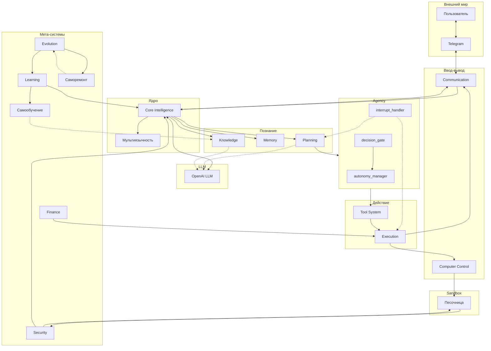

# План реализации агента: 12 систем на Python (полная версия)

Единый объединённый план архитектуры автономного ИИ-агента: 12 систем, критичные блоки, все слои (Agency, Tasks, Environment, Reflection, State, Runtime, Orchestration, Meta, HITL, Multi-Agent), полная структура проекта и порядок реализации.

---

## Контекст

- **Проект:** папка с `.env` (ключ OpenAI, токен Telegram).
- **Цель:** реализовать все 12 систем с нуля на Python.
- **Стек:** Python, OpenAI API, Telegram Bot API.

---

## Архитектура (основная схема)

Вся иерархия строится вокруг **LLM**. На схеме: **Telegram**, **Sandbox**, **мультиязычность**, **эволюция**, **самообучение**, **саморемонт**, **Agency**.



---

## Критичные блоки (9 дополнений)

1. **Перцепция** — `src/perception/`: multimodal, parsers, context_interpreter (между Communication и Core).
2. **Эмоционально-социальный** — `src/core/social.py` или Communication.
3. **Goal Manager** — `src/planning/goals.py`.
4. **Мониторинг и метрики** — `src/monitoring/` + State.
5. **Контекст-менеджер** — `src/memory/context_manager.py`.
6. **Симуляция и прогноз** — `src/planning/simulation.py`.
7. **Tool Orchestrator** — `src/tools/orchestrator.py` (автономный цикл observe → reason → plan → act → reflect → improve; см. **AUTONOMY.md**). **Governance** — `src/governance/` (Policy Engine: квоты, запрет критических путей).
8. **Этический слой** — `src/security/ethics.py`, `compliance.py`.
9. **Экономика вычислений** — `src/finance/cost_optimization.py`, `model_selector.py`.

---

## Слои (каталоги и модули)

| Слой | Каталог | Модули |
|------|---------|--------|
| Agency | `src/agency/` | autonomy_manager, decision_gate, interrupt_handler |
| Tasks | `src/tasks/` | manager, queue, task_state |
| Environment | `src/environment/` | filesystem, browser, api_world, virtual_env |
| Reflection | `src/reflection/` | self_review, prompt_optimizer, strategy_adjuster |
| State | `src/state/` | agent_state, confidence, activity_log |
| Runtime | `src/runtime/` | scheduler, event_loop, persistence |
| Orchestration | `src/orchestration/` | router, lifecycle, pipeline |
| Meta | `src/meta/` | strategy_selector, reasoning_modes, cognitive_control |
| HITL | `src/hitl/` | approvals, audit_log, dashboard_api |
| Multi-Agent | `src/multi_agent/` | messaging, coordination, roles |

---

## Полная структура проекта

```
agent/
├── .env
├── requirements.txt
├── README.md
├── src/
│   ├── __init__.py
│   ├── main.py
│   ├── perception/
│   ├── core/
│   ├── personality/
│   ├── planning/
│   ├── memory/
│   ├── knowledge/
│   │   └── graph/
│   ├── tools/
│   ├── execution/
│   ├── orchestration/
│   │   ├── router.py
│   │   ├── lifecycle.py
│   │   └── pipeline.py
│   ├── communication/
│   ├── computer_control/
│   ├── environment/
│   ├── tasks/
│   ├── agency/
│   ├── meta/
│   │   ├── strategy_selector.py
│   │   ├── reasoning_modes.py
│   │   └── cognitive_control.py
│   ├── reflection/
│   ├── state/
│   ├── runtime/
│   │   ├── scheduler.py
│   │   ├── event_loop.py
│   │   └── persistence.py
│   ├── hitl/
│   │   ├── approvals.py
│   │   ├── audit_log.py
│   │   └── dashboard_api.py
│   ├── multi_agent/
│   │   ├── messaging.py
│   │   ├── coordination.py
│   │   └── roles.py
│   ├── learning/
│   ├── security/
│   ├── finance/
│   ├── evolution/
│   └── monitoring/
├── config/
└── tests/
```

---

## 12 систем (кратко)

1. **Core Intelligence** — ядро, LLM, перцепция, State, personality, мультиязычность, social.
2. **Planning** — planner, goals, simulation.
3. **Memory** — short_term, long_term, context_manager.
4. **Knowledge** — store, retrieval, graph (builder, query, embeddings_linker), 120 профессий.
5. **Tool System** — registry, orchestrator, impl/.
6. **Execution** — executor, context, связь с Tasks.
7. **Communication** — Telegram, перцепция, мультиязычность.
8. **Computer Control** — controller, Environment, Sandbox.
9. **Learning** — feedback, adaptation, self_learning, Reflection.
10. **Security** — policy, validator, sandbox, ethics, compliance.
11. **Finance** — usage_tracker, limits, cost_optimization, model_selector.
12. **Evolution** — config_manager, versioning, self_repair, Reflection.

---

## Иерархия и детализация

Агент → 12 систем → Подсистемы → Модули → Подмодули → **Tasks | Processes | Policies | Interfaces | Settings | Monitoring**.

---

## Порядок реализации

1. Скелет и конфиг.
2. Core Intelligence + промпт.
3. Communication (Telegram).
4. Memory (short-term).
5. Tool System + Execution.
6. Planning.
7. Knowledge.
8. Computer Control + Security.
9. Security.
10. Finance.
11. Learning.
12. Evolution.

Далее — слои Agency, Tasks, Environment, Reflection, State, Runtime, Orchestration, Meta, HITL, Multi-Agent по необходимости.

---

## Важные моменты

- .env не коммитить; маппинг OPEN_KEY_API → OPENAI_API_KEY.
- Telegram — основной канал; Sandbox для опасных операций.
- Мультиязычность, самообучение, саморемонт, 120 профессий — в плане.
- Безопасность: Computer Control только через Sandbox.

---

## Ограничения самоизменения (self-modification)

**Минимальное правило безопасности (обязательно до реализации evolution.auto_patch и learning.rule_derivation):**

- **Self-modification requires sandbox validation.**  
  Патчи и изменения кода агента не применяются к работающему агенту напрямую. Любой патч сначала проверяется в песочнице.

**Правильный поток:**

```
Agent (stable)
      │
      ▼
rule_derivation
      │
      ▼
candidate_patch
      │
      ▼
sandbox_agent
      │
      ▼
auto_tests
      │
 pass / fail
      │
      ▼
apply_patch → stable_agent  (только при успехе)
```

- **auto_patch** не должен изменять код запущенного агента. Патч применяется к копии (candidate), в песочнице запускаются тесты; только после успеха — перенос в stable.
- Иначе возможен **self-modification cascade**: некорректный патч ломает агента, тесты падают, способность к самовосстановлению теряется.

**Ограничение правил (rule_derivation):**

- Без контроля числа и «веса» правил возникает **rule explosion** — сотни правил, деградация работы.
- Заложить заранее: **rule_limit**, **rule_score**, **rule_decay** (лимит количества, оценка полезности, затухание/ротация старых правил).

---

## Ограничения размножения агентов (agent_spawner)

**Правило (обязательно до реализации evolution.agent_spawner):**

- **Only Supervisor can create agents.**  
  Модуль `agent_spawner` не создаёт агентов напрямую. Он отправляет **spawn_request**; решение о создании принимает центральный контроллер (Supervisor).

**Проблема без ограничений:**

- **Recursive spawning:** A → B → C → D → … → **agent explosion** (десятки агентов, дублирование задач, перегрузка памяти и CPU).
- Потеря контроля: неясно, кто главный, кто завершает агентов, кто собирает результаты.

**Правильная схема:**

```
Supervisor
   │
   ├─ task_queue
   │      │
   │      ▼
   │   scheduler
   │      │
   ├─ Agent A
   ├─ Agent B
   └─ Agent C
```

- Задачи идут через **task_queue**, а не через прямое создание агентов под каждую задачу.
- **agent_spawner** — только запрос на создание (spawn_request), создание выполняет Supervisor.

**Безопасные ограничения:**

| Ограничение | Назначение |
|-------------|------------|
| **max_agents** | Лимит общего числа агентов. |
| **spawn_depth_limit** | Максимальная глубина порождения (A → B → C, не дальше). |
| **agent_ttl** | Время жизни агента; по истечении — принудительное завершение. |
| **task_queue** | Все задачи через очередь, без прямого spawning под задачу. |

Без этого возможны зависания, бесконечное делегирование и неконтролируемый рост числа агентов.

---

Полное описание каждого слоя и систем — в основном файле плана: `12_систем_агента_на_python_b310e409.plan.md` (в .cursor/plans/ или в корне проекта при экспорте).
